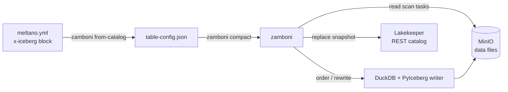
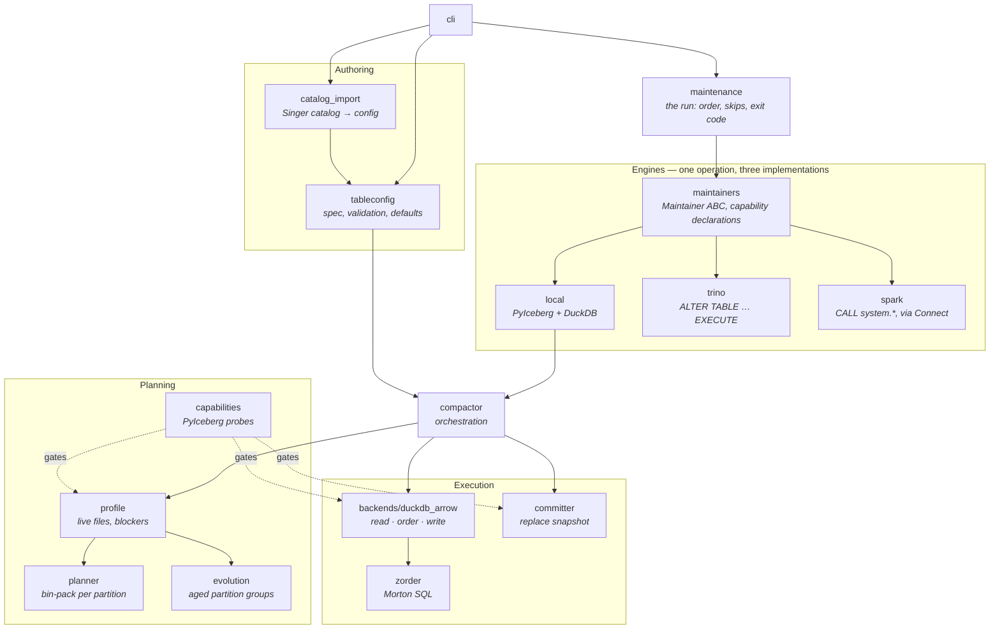
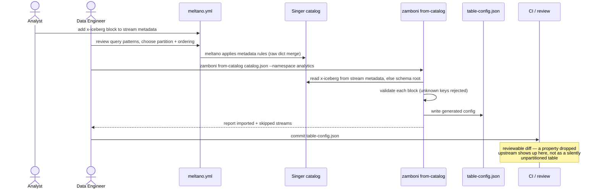
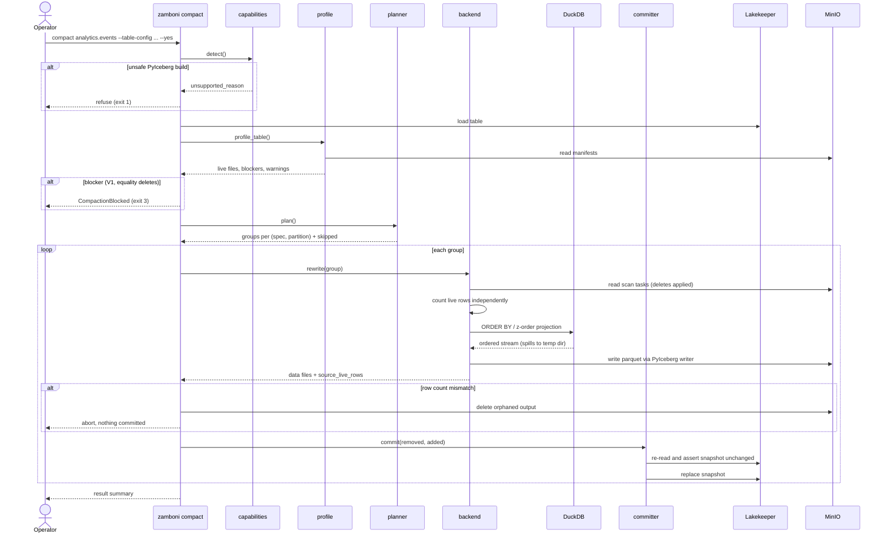
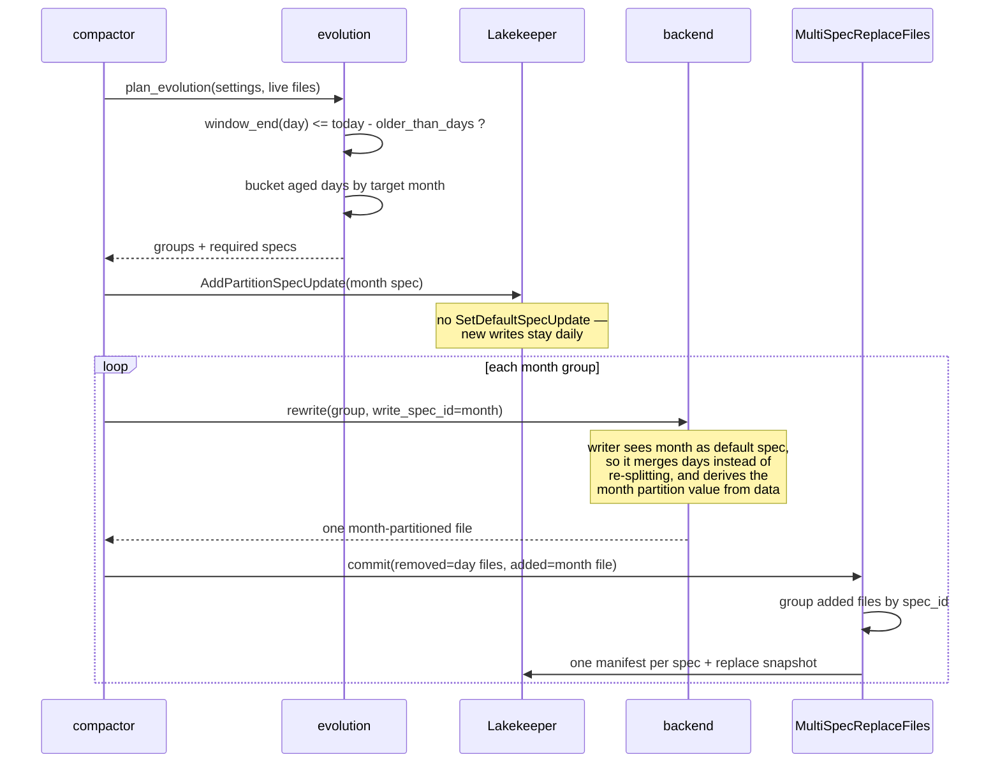
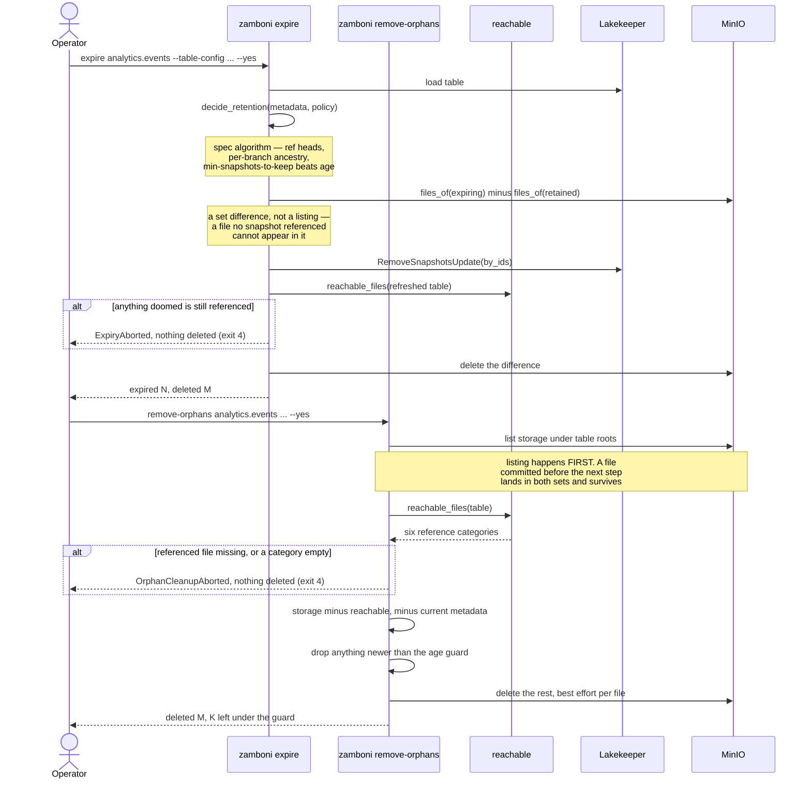
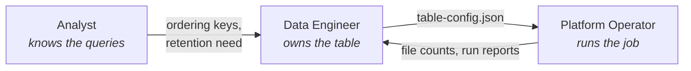

# Zamboni — High-Level Design

**Iceberg table maintenance for MinIO + Lakekeeper, without *needing* Trino or Spark —
and able to drive either when you have one.**

| | |
|---|---|
| Purpose | Why maintenance is needed, what the component does, and how it is put together |
| Delivery | [plan.md](plan.md) — scope, requirements traceability, verification, residual risk |
| Related | [table-config.md](table-config.md) — configuration reference · [live-verification.md](live-verification.md) — results against a real stack · [../README.md](../README.md) — operator guide |

---

## 1. Executive overview

### The problem

Streaming ingestion produces many small Iceberg data files, and every one of them costs
something at query time: more metadata to plan over, more objects to open, less effective
pruning. Every mature lakehouse solves this with a compaction job. **Our stack has no such
job**, and each candidate is missing it for a different reason:

| Component | Compaction? | Evidence |
|---|---|---|
| Lakekeeper OSS | No | Verified against a running 0.13.1: `GET /management/v1/info` reports `"queues": ["soft_deletion", "tabular_purge", "task_log_cleanup"]` — no compaction, expiry or orphan queue |
| PyIceberg 0.11.1 (latest release) | No | `table.maintenance` exposes only `expire_snapshots()`, which is metadata-only and deletes no files |
| DuckDB Iceberg extension (released) | No | Loading `iceberg` in DuckDB 1.5.4 exposes 16 `iceberg_*` functions; `iceberg_rewrite_data_files` is not among them |
| duckdb-iceberg `main` | Partially | Has `iceberg_rewrite_data_files`, but unreleased, **V2-only**, refuses partition-spec evolution, and never sorts |
| Trino / Spark | Yes | Capable, but a requirement of this project is not needing a cluster. Both are now supported *engines* — see §3 — so having one is an option rather than a precondition |

### The approach

A Python component that reads through PyIceberg's scan, rewrites with PyIceberg's writer,
orders with DuckDB, and commits an Iceberg `replace` snapshot. Layout intent is
**declarative**: Data Engineers and Analysts describe the target in `table-config.json`
(authored directly or in the Meltano catalog), and the tool derives the work.



### Why not the alternatives

- **Daft** — kept as a candidate for one reason (bucket-transform writes), which turned out
  unnecessary: PyIceberg handles bucket partitioning through its Rust core, proven by test.
  Daft also cannot read equality deletes and has no `replace`-snapshot primitive.
- **Ray** — `Table.to_ray()` is `ray.data.from_arrow(self.to_arrow())`, materialising the
  whole table before Ray sees it; the distributed write API is documented as alpha.
- **Dask** — no production Iceberg integration exists (`dask-iceberg`, `daskberg` are alpha
  and read-only).

---

## 2. Iceberg on disk: layout, growth, and why maintenance is necessary

Maintenance is not housekeeping for its own sake. What it does and why it is unavoidable
both follow from how Iceberg stores a table, so this section establishes that first.

### 2.1 The metadata tree

Iceberg organises metadata as a four-level tree. Each level narrows the search space, and
each is a *file* — which is why the tree itself is something that has to be maintained.

**Level 1 — Catalog pointer.** The catalog (Lakekeeper here; equally a REST catalog such as
Polaris, or Glue, or Hive Metastore) holds one pointer: the location of the current
`metadata.json`. That pointer is the table's single source of truth, and swapping it
atomically is what makes a commit a commit. The Iceberg REST specification defines this API,
so catalog implementations are interchangeable.

**Level 2 — Table metadata (`metadata.json`).** Schema (with column IDs), partition specs,
sort orders, table properties, snapshot list, and the metadata log. Each snapshot is a
complete, immutable version of the table. A commit writes a *new* `metadata.json` with the
new snapshot appended — the old one is not modified.
→ `{db}/{table}/metadata/{nnnnn}-{uuid}.metadata.json`

**Level 3 — Manifest list (Avro).** Each snapshot points to exactly one manifest list: a
table of contents naming every manifest in that snapshot, with partition-range summaries
per manifest. Those summaries let a planner skip an entire manifest that cannot match the
filter.
→ `{db}/{table}/metadata/snap-{snapshot-id}-{n}-{uuid}.avro`

**Level 4 — Manifest files (Avro).** Each manifest tracks a set of data and delete files.
Per file it records path, size, row count, partition values, and column statistics: lower
and upper bounds, null counts, NaN counts. These drive file-level pruning.
→ `{db}/{table}/metadata/{uuid}-m{n}.avro`

> Manifests can also carry `distinct_counts`, but the field is optional and in practice
> almost never written — PyIceberg does not write it. Do not plan a pruning strategy around
> it.

**Data files.** Parquet, ORC or Avro; Parquet in practice, because columnar layout is what
makes byte-range fetches of individual columns worthwhile.
→ `{db}/{table}/data/occurred_at_day=2026-01-05/{uuid}.parquet`

**Delete files.** Two write modes, and the version support differs:

| | Copy-on-write | Merge-on-read |
|---|---|---|
| An update… | rewrites the whole data file | writes a small file marking rows deleted |
| Write cost | high | low |
| Read cost | low | grows with delete-file count |
| Encoding | — | **position delete file (V2)** or **deletion vector, Puffin (V3+)** |

Row-level deletes arrived in **format version 2**, not V3; V3 changed the *encoding* to
binary deletion vectors (`spec.md`: "Position deletes are encoded in a position delete file
(V2) or deletion vector (V3 or above)"). This is why V1 is blocked outright here — it has
neither sequence numbers nor row-level deletes. Iceberg imposes no naming convention on
delete files; the demo's simulated ones are
`{db}/{table}/data/position-deletes-{hint}-{snapshot}-{n}-{rows}.parquet`.

Either mode ends in the same place: **fewer, larger data files and fewer manifests are
better for reads.** Compaction and manifest rewriting are what get you there; nothing in the
stack does either on its own.

### 2.2 How a query uses the tree

Iceberg avoids scanning a table by skipping at every level. Three mechanisms do the work,
and they are often conflated:

- **Hidden partitioning** maps a filter on the raw column (`occurred_at`) onto the
  transformed partition value (`occurred_at_day`) without the query naming the partition.
- **Manifest and column statistics** — the manifest-list partition summaries skip whole
  manifests; the per-file bounds inside a manifest skip whole data files.
- **Sort order** determines how tight those per-file bounds are. Clustered data means
  non-overlapping ranges and aggressive skipping; scattered data means every file's range
  covers the predicate and nothing is skipped. This is what `ordering` in
  `table-config.json` exists to control.

The planning path is: read the catalog pointer (1 request) → load `metadata.json` (1 read) →
read the manifest list, skipping irrelevant manifests → read the surviving manifests to
select data files. **All of that filtering happens in the engine, not the catalog.** The
REST catalog returns metadata; it does not evaluate predicates or choose files. (The REST
specification does define an optional server-side scan-planning API, but Lakekeeper 0.13.1
does not expose it — its advertised endpoint list has no `/plan`.)

Only once the file list is fixed does HTTP range reading come in, and purely as storage
I/O:

- read the Parquet footer by byte range to get row-group metadata, without fetching the
  file;
- then stream only the byte ranges of the requested columns.

Two consequences worth stating plainly. First, **planning cost scales with metadata file
count**, independent of how much data matches. Second, **skipping effectiveness depends on
layout** — partitioning, sort, and how many partitions each manifest spans.

### 2.3 How it grows

Every commit writes a new file at each level. Nothing is ever updated in place. So for a
table taking *N* commits:

| | Count after *N* commits |
|---|---|
| data files | ≥ *N* (one per partition touched per commit) |
| manifests | ≥ *N* |
| manifest lists | *N* |
| `metadata.json` | *N* + 1 |

The demo makes this concrete. `hims_events` ingests one commit per hour of activity, which
is what a streaming replication job does:

| After | rows | data files | manifests | manifest lists | `metadata.json` |
|---|---|---|---|---|---|
| day 1 | 107 | 11 | 11 | 11 | 12 |
| day 2 | — | 23 | 23 | 23 | 25 |
| day 3 | — | 35 | 35 | 35 | 38 |
| day 4 | — | 47 | 47 | 47 | 51 |
| day 5 | 625 | 58 | 58 | 58 | 63 |

Perfectly linear, and the endpoint is absurd: **625 rows in 58 files averaging 3.8 KiB,
with 340 KiB of metadata describing 218 KiB of data.** The metadata costs more than the data
it describes.

Note what the growth does to §2.2's skipping story. Each commit covers one hour of one day,
so each manifest spans exactly one day-partition — the manifest list *can* prune, and a
query for one day skips 46 of the 58. But the 12 that survive hold 12 data files between
them: **one manifest opened per data file read.** The metadata tier has stopped being an
index and become a second copy of the file list.

One maintenance run takes that to **1 data file and 1 manifest, 62 KiB of metadata, 625 rows
unchanged** — and, because the day partitions are older than the 90-day evolution rule, a
single `occurred_at_month` partition.

### 2.4 Why each operation exists

The growth above is not one problem but five, and each needs a different answer. This is the
whole justification for the operation set:

| Symptom | Cause | Operation |
|---|---|---|
| Many small data files; planning dominated by metadata | one commit per micro-batch | **compact** |
| Every manifest spans every partition, so none can be skipped | each commit's manifest holds whatever that batch touched | **rewrite-manifests** |
| Delete files referenced forever after compaction | compaction applies the deletes but cannot remove the files | **remove-dangling-deletes** |
| Disk usage does not fall after compaction | superseded files are still referenced by older snapshots, and remain readable by time travel | **expire** |
| Files nothing references at all | abandoned writes, and metadata versions dropped from the log | **remove-orphans** |

The last two are the ones most often missed, and they are ordered. **Compaction frees no
storage.** It writes new files and marks the old ones superseded, but every superseded file
is still referenced by the snapshot it was compacted out of, which is what makes time travel
work. Only expiry drops those references; only then is deletion possible.

And orphans are not hypothetical. The demo produces exactly four per table, all
`metadata.json`, and the cause is instructive: `SqlCatalog.create_table` writes the metadata
file to storage *before* it attempts the catalog insert, so
`create_table_if_not_exists` on an existing table leaves the file behind. The demo calls it
on every state-changing command, so days 2–5 each strand one file per table. That is the
canonical orphan — a write that was made and then abandoned — and it is precisely why
orphan removal cannot rely on the catalog to tell it what exists, and why it needs an age
guard: mid-write and abandoned look identical from the outside.

---

## 3. Architecture



`maintenance` is the entry point for both the CLI and an application: `zamboni
maintenance` is a printing adapter over `zamboni.maintain()`, so the operation order, the
skip when one operation is fulfilled by another, which exceptions are refusals rather than
failures, and when to stop after a safety abort exist once rather than twice.

| Module | Responsibility |
|---|---|
| `maintenance` | One run: every operation, in order, over every table. Shared by the CLI and `zamboni.maintain()` |
| `maintainers` | The engine seam: `Maintainer` ABC, three-valued support, per-operation capability declarations |
| `maintainers/local` | PyIceberg + DuckDB, in this process. The only engine with partition evolution, and the only one that previews everything |
| `maintainers/trino` | `ALTER TABLE … EXECUTE` against a coordinator. No Z-order, no dangling-delete removal |
| `maintainers/spark` | Iceberg stored procedures over Spark Connect, so no JVM is needed here |
| `settings` | `zamboni.yml` and `.env` discovery and precedence; the multi-tenant layout |
| `config` | `CompactionConfig`: how a run executes, as opposed to what the layout should be |
| `cli` | Argument parsing, printing, exit codes. Deliberately thin |
| `units` | One byte formatter, because four modules had diverged on it |
| `tableconfig` | The `table-config.json` specification: parse, validate, merge defaults |
| `catalog_import` | Extract `x-iceberg` blocks from a Singer catalog into a config |
| `capabilities` | Probe the installed PyIceberg structurally; gate unsafe builds |
| `session` | Lakekeeper REST catalog + DuckDB connection, or a local SQL catalog |
| `profile` | Walk manifests for live `DataFile` objects; raise blockers and warnings |
| `planner` | Group files by `(spec_id, partition)`; apply size and count thresholds |
| `evolution` | Find aged partitions; add the coarse spec; multi-spec commit producer |
| `backends/duckdb_arrow` | Read scan tasks → order in DuckDB → write via PyIceberg |
| `zorder` | Multi-key Morton encoding as DuckDB SQL |
| `committer` | Emit an Iceberg `replace` snapshot; concurrency check; orphan cleanup |
| `compactor` | Orchestrate: profile → plan → evolve → compact → verify |
| `reachable` | Every file the table references, in six categories. Safety-critical: both reclaim operations subtract this set from something else |
| `expire` | The spec's snapshot-retention algorithm, then delete the files it orphans |
| `orphans` | List storage, diff against `reachable`, age-guard, delete |
| `deletes` | Find delete files that apply to no live data file; drop them |
| `manifests` | Regroup manifest entries by partition so predicates prune |
| `properties` | Apply the declared metadata-retention table properties |
| `testing` | Construct states PyIceberg cannot write (V2 position deletes). Not runtime code |

### Key design decision: capability probing over version checks

Every version-dependent decision routes through `capabilities.detect()`, which asks the
installed PyIceberg structurally (does this function exist, what does this signature
accept). This is not defensiveness — three of the seven probes flip between 0.11.1 and
unreleased `main`, so a version comparison would need hand-revisiting on each release. On a
0.12 build the tool will automatically use PyIceberg's native streaming writes, and manifest
pruning becomes both available and safe, because the pruning and the predicate derivation it
requires land together.

What 0.12 does **not** lift, verified against `main` rather than assumed: the
equality-delete guard is still present, `ManifestWriterV2.content()` still returns `DATA`
unconditionally, and there is still no `ManifestWriterV3`. An earlier version of this
paragraph claimed the equality-delete blocker would lift on its own; it does not. The full
delta is in [roadmap.md RM-1](roadmap.md).

### Key design decision: the seam between operations and engines

The six mutating operations are Iceberg's, not Zamboni's, and Trino and Spark implement most
of them already. `zamboni.maintainers` is the seam that lets an operator ask for "maintain
this table" instead of "maintain this table with PyIceberg". All three engines are
implemented: `LocalMaintainer` (PyIceberg + DuckDB), `TrinoMaintainer` (`ALTER TABLE …
EXECUTE`), and `SparkMaintainer` (the Iceberg stored procedures, over Spark Connect so no
JVM is needed on the calling host). Each has been run against a real server — Trino 483 and
Spark 4.0.4 — and both are exercised by CI.

What the three engines do *not* have is a common feature set, which is the reason the seam
is shaped the way it is:

| | local | trino | spark |
|---|---|---|---|
| Z-order | yes | **no** | yes |
| Partition evolution | **yes** | no | no |
| Dangling-delete removal | partial (whole manifests) | **no** | yes (per file) |
| Output file size control | yes | **no** | yes |
| Preview without committing | **every operation** | none | `remove-orphans` only |

`zamboni engines` prints this from the declarations rather than from a table someone
maintained by hand.

The seam sits at the *operation*, and that is forced rather than chosen. Generating SQL is
unavailable to us — we drive metadata through PyIceberg and are the only one of the three
that is not a query engine. Driving manifest writers is unavailable to them — they expose
procedures. Operation-level is the only level all three implement.
[engine-comparison.md §5](engine-comparison.md) records the alternatives and why each fails.

**The interface exists to prevent papering over differences, not to hide them.** Its whole
surface is shaped by that: support is three-valued, and an `OperationSupport` that is
`PARTIAL` or `UNSUPPORTED` without naming a limitation **refuses to construct**;
previewability is per operation, because Spark's `remove_orphan_files` takes `dry_run` and no
other Spark procedure does; each declaration carries the *guarantees* a run makes, because
"both support remove-orphans" is true and misleading when ours aborts on four checked
conditions and a server-side procedure does its own thing; and config is validated per engine
at plan time, since a valid `table-config.json` can be unusable against a default Trino,
whose retention floors reject our defaults outright.

**Where an engine cannot preview, a run without `--yes` is refused** — not executed, and not
dressed up as a dry run it did not perform. Refusing commits nothing, so the rule in §6 that
nothing is committed without `--yes` holds on every engine and keeps its zero exceptions.

---

## 4. Table configuration

Full reference: **[table-config.md](table-config.md)**. Worked example:
[../examples/table-config.json](../examples/table-config.json).

```json
{
  "version": 2,
  "warehouse": "acme",
  "defaults": {
    "partition_evolution": {
      "enabled": true,
      "rules": [{ "from": "day", "to": "month", "older_than_days": 90 }]
    }
  },
  "namespaces": {
    "analytics": {
      "tables": {
        "events": {
          "partition": [
            { "column": "occurred_at", "transform": "day" },
            { "column": "tenant_id", "transform": "bucket", "num_buckets": 16 }
          ],
          "ordering": {
            "mode": "zorder",
            "zorder": { "columns": ["customer_id", "product_id"], "precision_bits": 16 }
          },
          "target_file_size_bytes": 268435456,
          "min_input_files": 4
        }
      }
    }
  }
}
```

**The document is warehouse → namespace → table**, which is `database.schema.table` in
Postgres or Snowflake terms. Version 1 keyed tables by a dotted string and left the split to
be *guessed*: `rpartition` resolved `raw.telemetry.events` to namespace `('raw','telemetry')`
in the local engine and to a single schema named `raw.telemetry` in Trino, the same key
naming two different tables with no error anywhere. Stating the namespace and forbidding a
dot in the table name removes the guess rather than handling it.

`warehouse` is required and **asserts** rather than selects. `--warehouse`/`--db`, the
profile, or the per-customer directory chooses; this confirms, so a config copied into the
wrong tenant's directory is an error before anything is touched.

| Section | Purpose | Default |
|---|---|---|
| `warehouse` | Which warehouse this file describes | **required** |
| `namespaces.<ns>.tables.<name>` | Per-table settings; the name may not contain a dot | — |
| `partition` | Iceberg partition fields | none (unpartitioned) |
| `partition_evolution` | How partitioning ages | **enabled**, day→month at 90 days |
| `ordering` | `none` \| `sort` \| `zorder` | `none` |
| `target_file_size_bytes` | Output size | table property, else 128 MiB |
| `min_input_files` | Compaction threshold | 2 |

`defaults` applies to every table; a table's block overrides it **per section**, so what you
read in one block is what applies. Unknown keys are rejected. `namespaces.<ns>` is an object
wrapping `tables` so namespace-level defaults can be added without a further version bump.

---

## 5. Sequence diagrams

### 5.1 Authoring → generation



### 5.2 Compaction run



### 5.3 Partition evolution (days → months)



### 5.4 Reclaiming storage

Compaction commits and stops. Nothing on disk has gone away: the superseded files are
still referenced by the snapshot they were compacted out of. These two operations are what
actually free bytes, and the ordering between them is not interchangeable.



---

## 6. Constraints

### 6.1 Upstream — Iceberg format

| Constraint | Consequence |
|---|---|
| Format version 1 has no sequence numbers or row-level deletes; DuckDB refuses to write V1 | V1 tables are **blocked**; upgrade to V2 first |
| A data file under a `day` spec holds exactly one day value | Days→months **requires** a second partition spec; it cannot be done by rewriting alone |
| `spec_id` is not stored in the data-file struct — it is derived from the manifest | Freshly written files carry no spec until the committer assigns one |
| A new partition field must take a **fresh** id from `last-partition-id`. A manifest's partition struct uses partition field ids as its struct field ids, so reusing the day field's id for a month field leaves one id meaning two different things — the v1 defect v2 added this counter to prevent | Evolution allocates `last_partition_id + 1`; asserted by `test_new_partition_field_gets_a_fresh_id` |
| Delete files apply by sequence number | Compacted files get a higher sequence number, so old deletes correctly stop applying |

### 6.2 Upstream — PyIceberg 0.11.1 (latest release)

| Constraint | Handling |
|---|---|
| Cannot emit `Operation.REPLACE` — `update_snapshot_summaries` rejects it, in 0.11.1 **and** `main` | `_ReplaceFiles` computes the summary as an overwrite and relabels |
| `_SnapshotProducer._manifests` hardcodes the added manifest to the **default** spec while grouping deleted entries by each file's own spec | `MultiSpecReplaceFiles` corrects the asymmetry; without it, evolution silently corrupts metadata |
| Scan planning raises on **equality deletes** | Such tables are blocked, capability-gated so the block lifts automatically |
| No streaming write path (`_dataframe_to_data_files` takes a `pa.Table`) | Bin-packing done locally; native path used when a build has it |
| Partitioned streaming writes unsupported (apache/iceberg-python#2152) | Partitioned tables always bin-pack locally |
| `add_files` cannot infer non-order-preserving partition values | Writes go through `_dataframe_to_data_files`, which derives the key from data |
| The `bucket`, `truncate`, `year`, `month`, `day` and `hour` transforms compute partition values in the Rust core | Declared explicitly. On 0.11.1 `pyiceberg[pyarrow]` requires `pyiceberg-core` and there was nothing to declare; **0.12 moved it to an extra of its own** while `pyarrow_transform` still needs it, so `[pyarrow]` alone raises `NotInstalledError` on any transformed partition. `test_the_rust_core_is_installed_however_it_gets_here` fails if neither side declares it |
| `expire_snapshots()` is metadata-only and ignores most of the retention spec | Retention algorithm and file deletion implemented here (`expire.py`); PyIceberg is used only to commit the `RemoveSnapshotsUpdate` |
| `FileIO` has no list operation | Orphan removal reaches `PyArrowFileIO._initialize_fs()` for a `pyarrow.fs` filesystem, which covers local paths and S3/MinIO alike |

Every private symbol behind the handling column, why each is unavoidable, and
what stops an upstream rename from becoming a corrupted table:
[pyiceberg-private-api.md](pyiceberg-private-api.md). It also records what this
surface actually did across 0.11.1 → 0.12.0, which was measured rather than
guessed: nothing in the inventory changed, and two things broke anyway.

### 6.3 Upstream — Meltano / Singer

| Constraint | Consequence |
|---|---|
| The Singer SDK's typed `Metadata`/`Schema` **silently drop unknown keys** on round-trip (verified against the SDK checkout) | The catalog is an authoring surface, not a transport — hence a **generated** artifact |
| Meltano core edits the catalog as raw dicts | `x-iceberg` keys authored in `meltano.yml` survive its metadata/schema rules |

### 6.4 Environment

| Constraint | Consequence |
|---|---|
| PyIceberg's SQL-catalog extra pins SQLAlchemy, which a shared site-packages need not satisfy | Everything runs from a locked `uv` venv; nothing resolves against global packages, so no global pin can conflict. Only the `sql` extra pulls SQLAlchemy in — a REST-catalog install never meets the constraint |
| The `bin/zamboni` executable pins its Python from `.python-version` | The shipped executable runs the interpreter the tests ran on |
| Lakekeeper OSS has no maintenance queues | Expiry and orphan removal run from this tool, scheduled by the operator |
| A remote-signing Lakekeeper warehouse (`sts-enabled: false`, `push-s3-delete-disabled: true`) signs object GET/PUT only | `ListObjectsV2`, `HeadObject` and multi-object `DELETE` are refused, so compaction fails and no storage can be reclaimed. Needs STS-vended or direct credentials — measured in [live-verification.md](live-verification.md) |
| Lakekeeper returns storage settings per table in the load-table response | Those properties win over client config, so `py-io-impl`, `s3.endpoint` and `s3.remote-signing-enabled` cannot be overridden from the client |

### 6.5 Functional limits

- **Partition evolution needs one unambiguous time field.** A compound spec evolves when
  exactly one field matches the rule's granularity; two that do are skipped, because
  `older_than_days` is measured from a window end and two fields give two answers.
- **Equality deletes are blocked**, pending upstream support.
- **`max-ref-age-ms` is applied**, dropping the ref so its snapshots can expire, but only
  when configured — the default is "not set", because removing a named tag or branch destroys
  metadata someone chose to create. `main` is exempt.
- **Delete manifests cannot be written** — `ManifestWriterV2.content()` returns
  `ManifestContent.DATA` unconditionally. Dangling-delete removal is therefore limited to
  dropping whole delete manifests, and manifest rewriting leaves delete manifests alone.
- **Format version 3** is blocked for compaction, because row lineage cannot survive a
  scan-and-rewrite. Metadata-only operations are unaffected.
- **V3 deletion vectors** can be read but not written — PyIceberg ships a Puffin reader and
  no writer — so a V3 merge-on-read table can be profiled but its deletes cannot be
  simulated the way V2 position deletes are.
- **A run commits once by default**, matching Iceberg's `partial-progress.enabled=false`, so
  a failure anywhere leaves the table exactly as it was. `--partial-progress` commits each
  group instead, which is preferable on a table too large to redo. Iceberg is explicit that
  this is not a correctness question: "file groups can be compacted independently".
- **A remote-signing Lakekeeper warehouse permits no reclamation.** Its signer refuses
  `ListObjectsV2`, `HeadObject` and multi-object `DELETE`, so compaction fails and nothing
  can be freed. See [live-verification.md](live-verification.md).
- **Compaction holds roughly one data file in memory, not one partition.** The streaming
  path reads one file per call and bin-packs the result, so peak scales with the largest
  *file* and a partition larger than RAM still compacts. It was not always so: reading the
  whole task list at once made peak grow with the group, because PyIceberg materialises each
  file and submits every task before the consumer drains any. Group size still governs how
  long a rewrite takes, what a failure wastes, and how large the orphan guard must be.
- **Nested namespaces need different SQL on each engine, and each rejects the other's.**
  Verified against live servers: Trino addresses `raw.telemetry.events` as
  `"ice"."raw.telemetry"."events"` — one schema identifier containing a dot, which is what
  `nested-namespace-enabled` turns on — and fails the per-level form with "Too many dots in
  table name"; Spark requires `` `ice`.`raw`.`telemetry`.`events` `` and refuses a dot
  inside a part. Zamboni emits the right form for each, so this is handled rather than left
  to the operator, but a layout needing two incompatible spellings does not map onto
  `database.schema.table` and is worth avoiding.
- **Spark's `remove-orphans` needs credentials Zamboni cannot supply.** It lists through
  Hadoop S3A rather than Iceberg FileIO, so it needs `spark.hadoop.fs.s3a.*` on the Spark
  server. Every other operation runs on the catalog's vended credentials. Get it wrong and
  exactly one of the six fails while the rest pass.


### 6.6 Safety invariants for deletion

Orphan removal is the only operation that decides what to delete by subtracting a computed
set from a directory listing, and it is on by default. These are what make that defensible.
All of them **abort the run** rather than delete:

1. **Completeness.** Every referenced file must be present in the listing. A
   referenced-but-absent file means our view of storage is wrong — wrong root, partial
   listing, permissions — and the complement of a partial listing is meaningless. This is
   not hypothetical: it is what caught a real keying bug during live verification instead of
   deleting every live file.
2. **Non-empty categories.** A table with snapshots necessarily has data files, manifests
   and manifest lists. Any of those coming back empty is a bug in the reachability
   computation, not an empty table.
3. **Current metadata is sacred.** `metadata_location` is never a deletion candidate,
   whatever the diff says.
4. **No other table shares this location.** Every other table in the catalog is checked, and
   the run refuses if any of their locations overlaps ours. Scoping the sweep to the table's
   own roots prevents a warehouse-wide sweep; it does *not* prevent a second table living
   *inside* those roots, whose files are then unreferenced here and live there. Two tables
   reach one directory without anyone misconfiguring anything: a default location is derived
   from the table name **at creation time**, renaming rewrites the catalog entry and moves no
   files, and re-creating the freed name derives the same location again. In a reproduction
   this destroyed the renamed table outright — every file, including its current metadata
   (ZMBNI-507). The check costs one metadata read per table in the catalog, because a
   location is only knowable by loading the table.

Two further properties are structural rather than checked:

4. **List storage before computing reachability.** A file committed between the two steps
   lands in *both* sets and survives. The reverse order puts it in the listing but not in
   reachable, and deletes it despite being committed. The order is load-bearing.
5. **The age guard** backstops writes already in flight when the run started. It applies to
   file mtime, defaults to 3 days, and does **not** protect long-running readers — mtime is
   the wrong clock for that, and snapshot retention is the right mechanism there.

Expiry needs none of this, because it never looks at storage: it deletes the set difference
between files reachable before the commit and after it. A file no snapshot ever referenced
cannot appear in that difference, so expiry structurally cannot touch a concurrent writer's
in-flight output.

---

## 7. Responsibilities



### Analyst

**Owns: what the queries look like.**

- Name the columns queries filter on, and whether they are used **together** (→ z-order) or
  with a clear leading key (→ sort).
- State the time granularity queries ask for, and how far back the fine granularity still
  matters — this sets `older_than_days`, or justifies disabling evolution (as in the
  `audit_log` example, where auditors ask for single days years back).
- Review generated `table-config.json` diffs for tables they query.

**Does not** choose file sizes, transforms, or memory settings.

### Data Engineer

**Owns: the table's physical layout.**

- Author the `x-iceberg` block in `meltano.yml`, or `table-config.json` directly.
- Choose partition columns and transforms; keep partition cardinality sane (bucket
  high-cardinality keys rather than partitioning by them).
- Set `target_file_size_bytes` and `min_input_files` where the default does not fit.
- Decide per-table `partition_evolution`, including opting out.
- Run `zamboni from-catalog` and `validate-config` in CI; commit the generated artifact.
- Read `zamboni describe` output — the size histogram and blocker list are the signal that
  a layout choice is not working.

**Does not** manage catalog credentials or the job schedule.

### Platform Operator

**Owns: that the job runs safely.**

- Schedule `zamboni compact --table-config ... --yes`, with `--dry-run` first on a new
  table.
- Manage Lakekeeper/MinIO credentials and the `ZAMBONI_*` environment.
- Tune operational settings — `--memory-mode`, `--memory-budget-bytes`,
  `--temp-directory`, `--branch`. These deliberately stay on the command line, not in the
  file analysts own.
- Run `zamboni doctor` after any dependency upgrade, and regenerate `bin/zamboni` after
  `uv sync --upgrade`.
- Watch for `CompactionBlocked` (exit 3) and dangling-delete-file counts.

**Does not** change partitioning or ordering — those are layout decisions.

### Boundary in one line

> Analysts describe **queries**. Data Engineers describe **layout**. Operators decide
> **when and with what resources** the layout is realised. The config file is the contract
> between the first two; the CLI flags are the contract between the second two.
